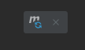

**Инструкция, выполнив которую можно запустить тест и получить скриншоты в папке «output».**

      1. Для написания автотеста понадобилась установка библиотек:
- Библиотека Selenium Java версии 3.141.59.
- Библиотека Junit версии 4.13.

Расположение зависимостей в pom.xml.:

При необходимости зависимости Maven нужно обновить, нажав кнопку в правом углу экрана:

      2. Расположение класса с автотестом в структуре проекта:
- Раскроем структуру проекта. 
- Директория src содержит в себе две директории: «main» и «test». Нам нужна директория «test».
- Откроем директорию «test», она содержит директорию «java».
- В Директории «java» содержится класс «ScreenAvito», в котором написан код автотеста.

Расположение класса «ScreenAvito» в структуре проекта:

      3. Запуск теста:
- Открываем класс «ScreenAvito».
- Нажимаем зеленую кнопку запуска теста:

- Наблюдаем работу автотеста.
- Успешное выполнение автотеста завершается отправкой скриншота в папку «output»:

