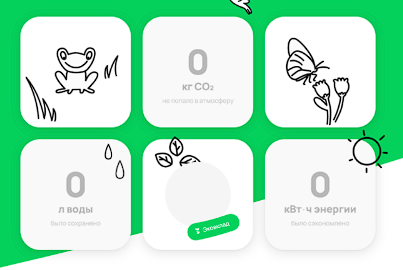
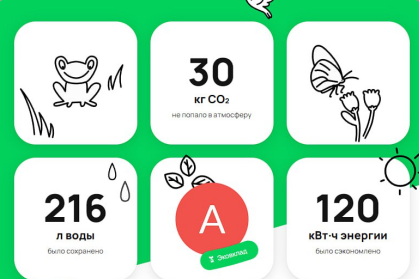

**1: Проверка автоматизации тестирования счётчиков десктопной версии без авторизации через браузер Google Chrome.**

Предусловие: пользователь не авторизован.

1.1.	 Открыть страницу через браузер **Google Chrome;**

1.2.	 Проскроллить страницу до нужного элемента – таблицы счетчиков эковклада
(By.className("desktop-impact-items-F7T6E")):

1.3.     Сделать скриншот таблицы счетчиков эковклада;

1.4.	 Сохранить скриншот в папку «output»;

1.5.	 Удостовериться, что счетчики эковклада отображаются корректно.

**2: Проверка автоматизации тестирования счётчиков десктопной версии с авторизацией через браузер Google Chrome.**

Предусловие: пользователь авторизован.

1.1.	 Открыть страницу через браузер **Google Chrome;**

1.2.	 Проскроллить страницу до нужного элемента – таблицы счетчиков эковклада
(By.className("desktop-impact-items-F7T6E")):

1.3.     Сделать скриншот таблицы счетчиков эковклада;

1.4.	 Сохранить скриншот в папку «output»;

1.5.	 Удостовериться, что счетчики эковклада отображаются корректно.

**3: Проверка автоматизации тестирования счётчиков десктопной версии без авторизации через браузер Яндекс.**

Предусловие: пользователь не авторизован.

3.1.	 Открыть страницу через браузер **Яндекс**;

3.2.	 Проскроллить страницу до нужного элемента – таблицы счетчиков эковклада
(By.className("desktop-impact-items-F7T6E")):

3.3.     Сделать скриншот таблицы счетчиков эковклада;

3.4.	 Сохранить скриншот в папку «output»;

3.5.	 Удостовериться, что счетчики эковклада отображаются корректно.

**4: Проверка автоматизации тестирования счётчиков десктопной версии с авторизацией через браузер Яндекс.**

Предусловие: пользователь авторизован.

4.1.	 Открыть страницу через браузер **Яндекс**;

4.2.	 Проскроллить страницу до нужного элемента – таблицы счетчиков эковклада
(By.className("desktop-impact-items-F7T6E")):

4.3.     Сделать скриншот таблицы счетчиков эковклада;

4.4.	 Сохранить скриншот в папку «output»;

4.5.	 Удостовериться, что счетчики эковклада отображаются корректно.

